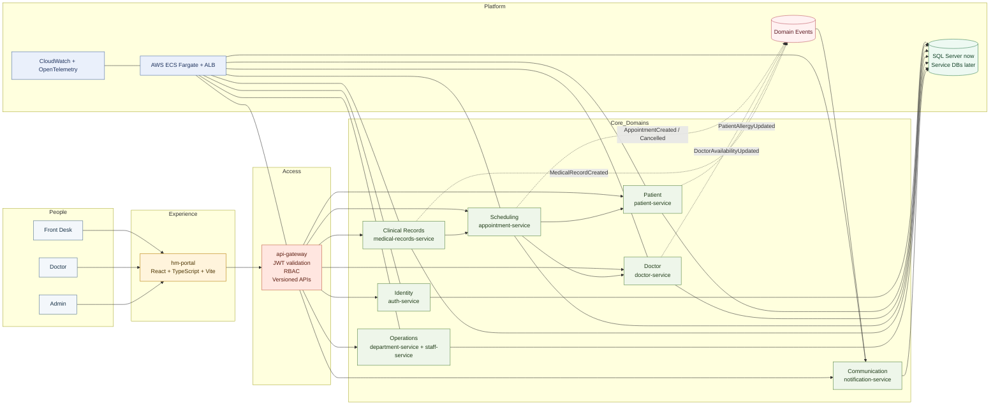
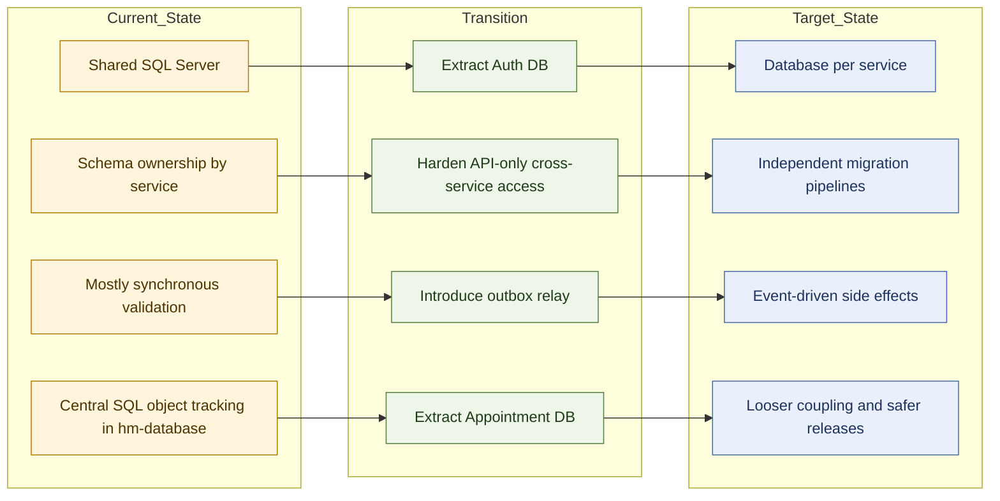

# Hospital Management Architecture Board

This board is the compact, presentation-first version of the architecture. It is meant for design walkthroughs, stakeholder reviews, and roadmap conversations where the audience needs a clear picture of how the platform works now and how it is expected to evolve.

## At a Glance

- Frontend: hm-portal is the single hospital web experience
- Public entry: api-gateway is the only supported external API boundary
- Core domains: auth, patient, doctor, appointment, medical records, department, staff, notification
- Current data posture: shared SQL Server with schema ownership rules
- Target data posture: service-owned persistence with event-driven side effects
- Target runtime: AWS ECS Fargate behind ALB with Terraform-managed infrastructure

## Executive Board View

## Current to Target Transition

## Service Ownership Strip

| Domain           | Owning Service                    | Owns                                           | Depends On                                    | Emits or Integrates With                                           |
| ---------------- | --------------------------------- | ---------------------------------------------- | --------------------------------------------- | ------------------------------------------------------------------ |
| Identity         | auth-service                      | users, roles, tokens, credentials              | gateway                                       | UserRegistered, UserRoleChanged, PasswordChanged                   |
| Patient          | patient-service                   | patients, allergies, vitals, insurance         | auth claims                                   | appointment-service, medical-records-service                       |
| Doctor           | doctor-service                    | doctors, qualifications, availability, ratings | gateway                                       | appointment-service, department-service, DoctorAvailabilityUpdated |
| Scheduling       | appointment-service               | appointments, symptoms, prescriptions          | patient-service, doctor-service               | AppointmentCreated, AppointmentCancelled, notification-service     |
| Clinical Records | medical-records-service           | medical_records, patient_medical_history       | patient-service, optional appointment-service | MedicalRecordCreated                                               |
| Operations       | department-service, staff-service | departments, services, staff, shifts           | gateway                                       | doctor-service, staff-service internal coordination                |
| Communication    | notification-service              | templates, outbound messages, delivery state   | event backbone                                | email or SMS channels as an implementation detail                  |

## Core Journey Strip

```mermaid
flowchart LR
    classDef primary fill:#fff4dc,stroke:#b47a00,color:#4c3400,stroke-width:1px;
    classDef service fill:#eef6ea,stroke:#4f7f39,color:#1f3b17,stroke-width:1px;
    classDef async fill:#fff1f1,stroke:#bb4f5d,color:#5b1820,stroke-width:1px;

    U[User Action] --> P[hm-portal]
    P --> G[api-gateway]
    G --> A[Domain Service]
    A --> V[Cross-service validation if required]
    V --> W[Write transaction]
    W -. publish event .-> E[Domain Event]
    E --> N[notification-service]
    N --> C[Reminder or alert channel]

    class U,P,G primary;
    class A,V,W,N service;
    class E,C async;
```

## Design Narrative

### Access path

- Users interact only through hm-portal.
- hm-portal calls api-gateway.
- api-gateway performs authentication, request routing, and boundary enforcement.

### Domain path

- auth-service owns identity and access concerns.
- patient-service owns patient demographics and clinical profile metadata.
- doctor-service owns physician profile and availability.
- appointment-service owns scheduling, slot conflict rules, and lifecycle state.
- medical-records-service owns encounter records and clinical history.
- department-service and staff-service own operational structure and workforce data.
- notification-service handles outbound communications and delivery tracking.

### Data path

- Today, the platform is optimized for delivery speed with one SQL Server instance and service-level schema ownership.
- Next, auth and appointment are the best candidates to split first because they have clear boundaries and high change frequency.
- Later, each service should own its own persistence model and release its schema independently.

### Integration path

- Synchronous calls stay on critical validation paths such as doctor availability and patient existence checks.
- Notifications and other non-blocking side effects should move to event-driven flows.
- Once service databases are extracted, outbox relay becomes the preferred publishing mechanism.

## What This Board Is Saying

### Current priorities

- Keep the gateway as the only public entry point.
- Enforce schema ownership while the database is still shared.
- Keep notifications off the critical transaction path.
- Standardize correlation IDs, tracing, and versioned APIs across all services.

### Next architecture moves

- Choose the event backbone technology explicitly.
- Define the first two datastore extractions with rollback plans.
- Formalize API and data ownership contracts.
- Capture key decisions in ADRs so the migration path does not drift.

## Suggested Usage

- Use this file for stakeholder reviews and architecture presentations.
- Use ARCHITECTURE_DIAGRAMS.md for direct Mermaid rendering and engineering deep dives.
- Use ARCHITECTURE_DOCUMENTATION.md for implementation planning, governance, and migration detail.
