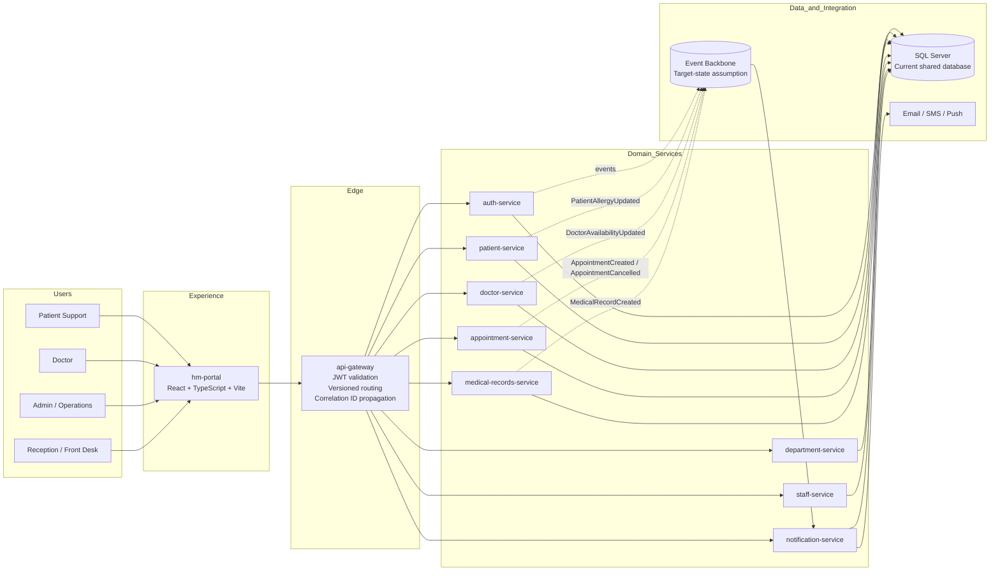
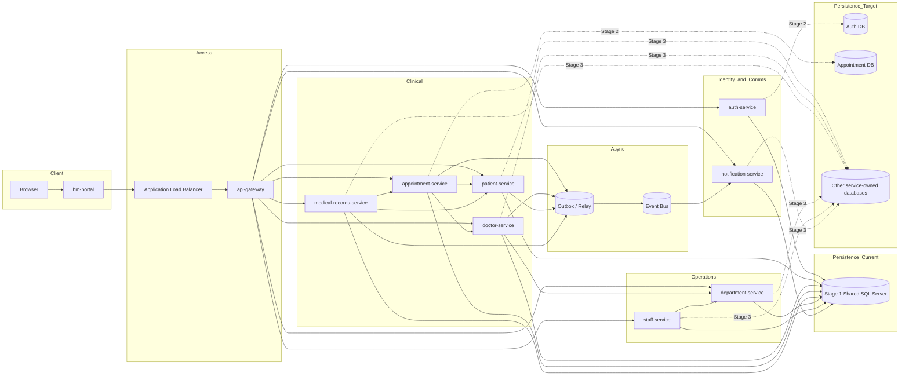
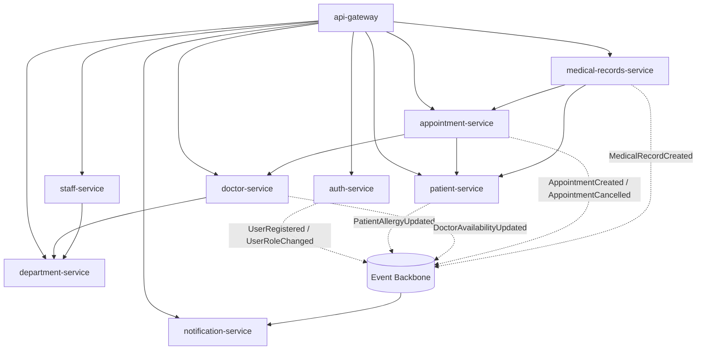
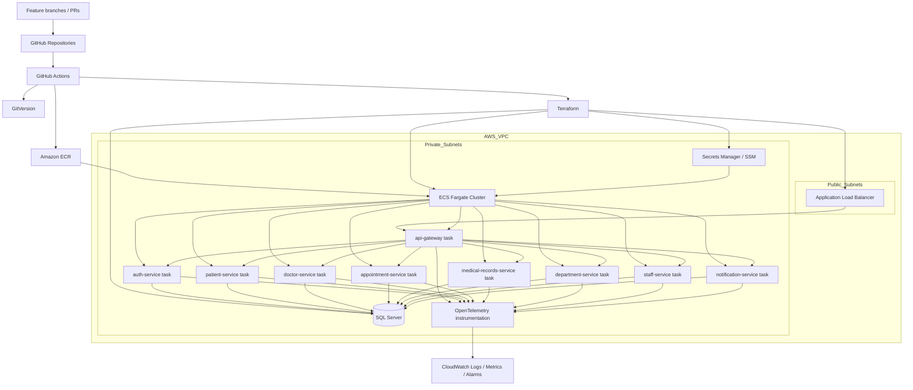
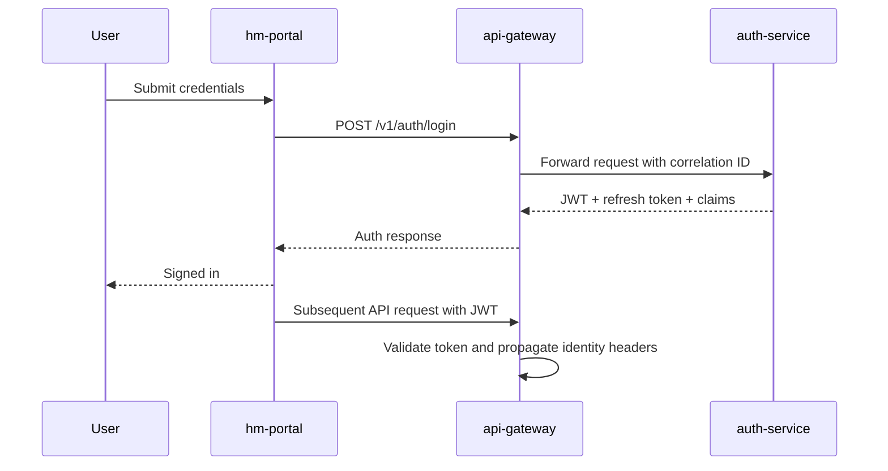
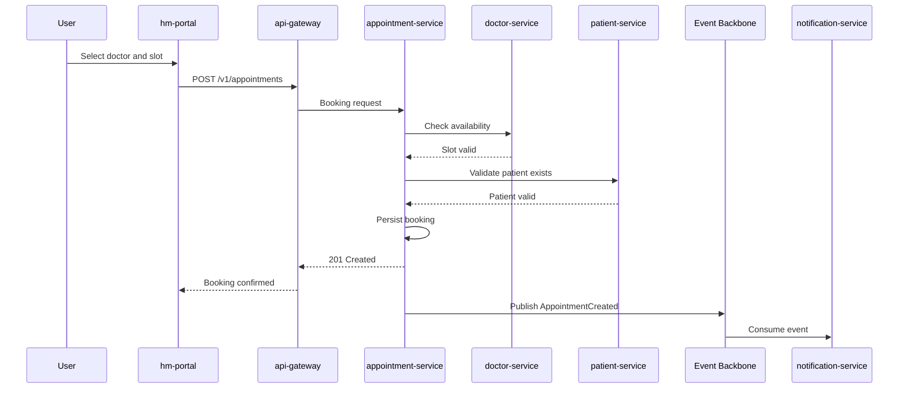
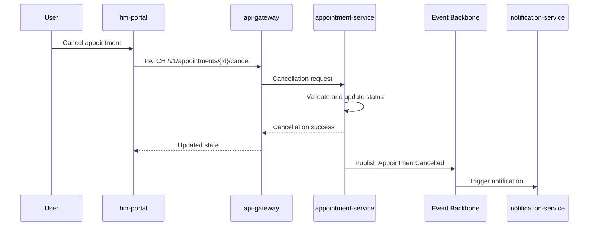
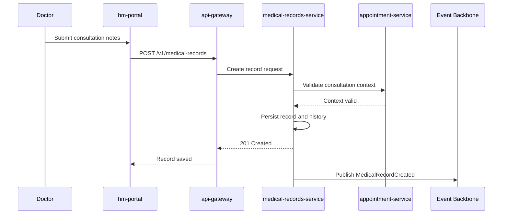

# Hospital Management Architecture Diagrams

This file is a diagrams-only companion to the main architecture document. It is optimized for direct Mermaid rendering in Markdown viewers, documentation portals, and design review sessions.

## 1. System Context Diagram

## 2. Container and Microservices Architecture

## 3. Service Interaction Diagram

## 4. Deployment and Infrastructure Diagram

## 5. Flow Diagram: User Login and Token Validation

## 6. Flow Diagram: Appointment Booking with Availability Check

## 7. Flow Diagram: Appointment Cancellation and Notification

## 8. Flow Diagram: Medical Record Creation After Consultation

