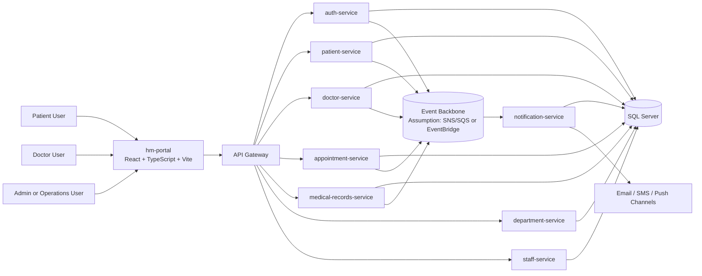
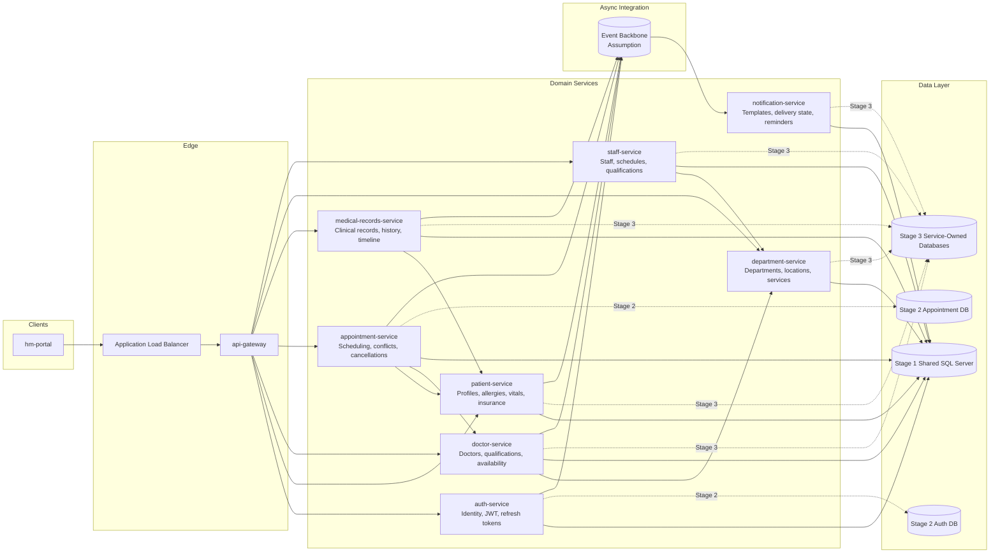
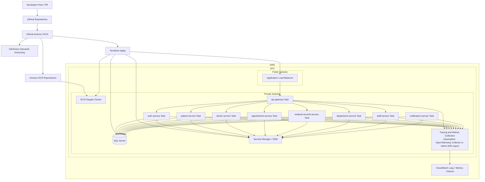
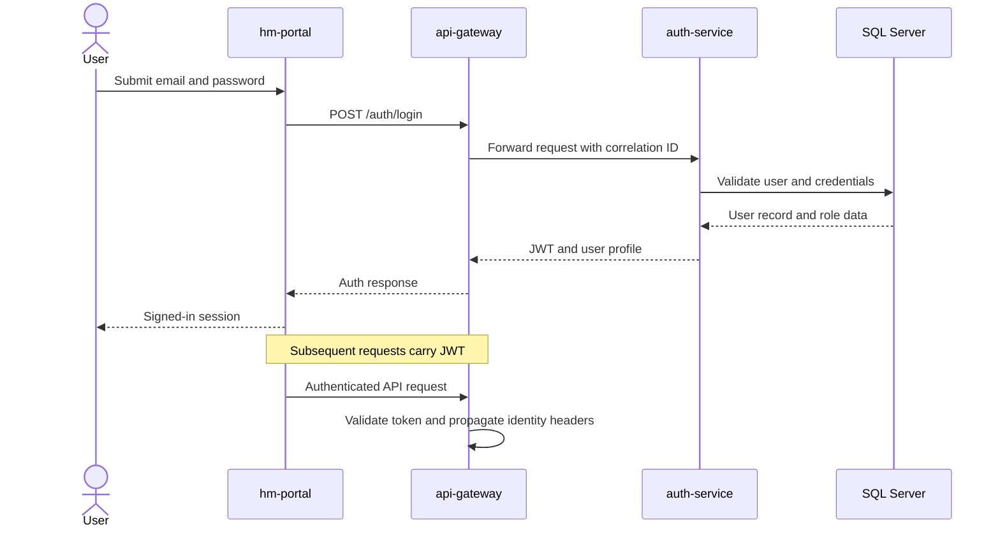
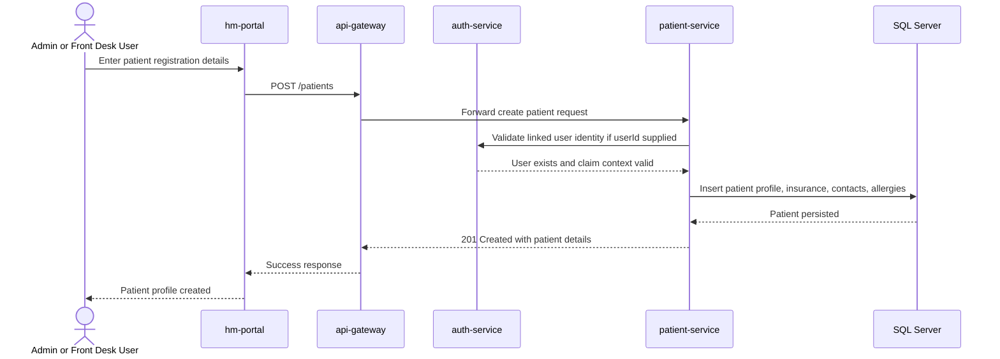
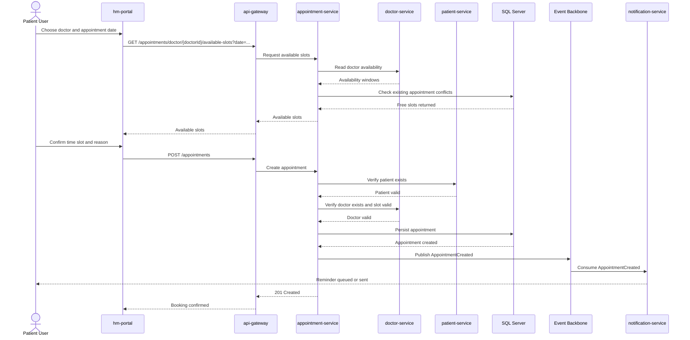
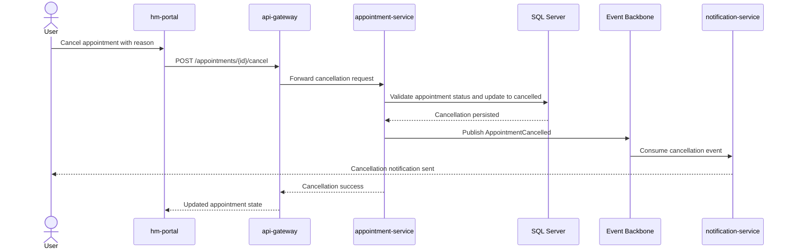
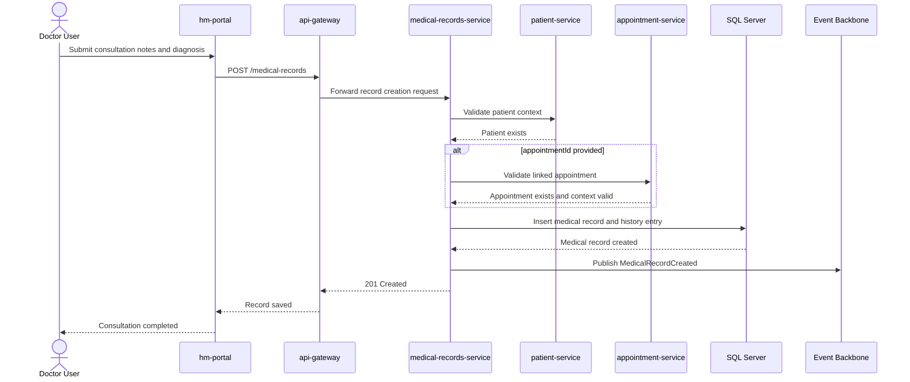

# Hospital Management Architecture Documentation

## Executive Summary

The Hospital Management platform is organized as a domain-oriented microservices system with a unified React web portal, a gateway-based API entry layer, and a set of .NET backend services aligned to clinical and operational bounded contexts. The current repository state indicates an architecture that is already decomposed at the repository level while still retaining a phased data strategy that begins with shared SQL Server ownership rules and moves toward service-owned persistence.

The target platform is AWS-based, using ECS Fargate for service hosting, Amazon ECR for image storage, Terraform for infrastructure provisioning, GitHub Actions for CI/CD, and CloudWatch plus distributed tracing for observability. Externally, clients should interact only with the gateway, while internal services communicate over private networking and, where appropriate, asynchronous domain events.

The key architectural tension in this project is the transition from shared relational persistence to stricter service autonomy without breaking clinical workflows such as patient onboarding, appointment booking, and medical record capture. The recommended model is a staged migration that preserves delivery speed now while preventing long-term coupling.

## Architecture Overview

### Current-State View

- The frontend exists as a unified React + TypeScript portal in `hm-portal`.
- Backend capabilities are separated into independent service repositories such as auth, patient, doctor, appointment, medical-records, department, staff, and notification.
- A dedicated SQL repository tracks object-level SQL Server assets, indicating strong schema management practices even before full database decomposition.
- Workspace documentation defines an `api-gateway` even though its repository is not currently visible in the workspace snapshot.
- The documented migration approach indicates the system may still operate with a shared SQL Server instance under schema ownership rules.

### Target-State View

- All external client traffic enters through the API gateway.
- Each microservice owns its business logic and increasingly its persistence boundary.
- Domain events are used for notification and cross-service reactions.
- AWS infrastructure is provisioned through Terraform and deployments are automated through GitHub Actions.
- Observability, trace propagation, and correlation IDs are treated as platform requirements rather than optional add-ons.

### Architectural Style

- Frontend: SPA web portal built with React, Vite, Redux Toolkit, Axios, React Router, Tailwind CSS, and Recharts.
- Backend: .NET microservices with layered internal structure.
- Data: SQL Server with phased decomposition from shared to service-owned stores.
- Infrastructure: AWS ECS Fargate behind an Application Load Balancer.
- Delivery: GitHub Actions with GitVersion-driven semantic image tagging.

## System Context Diagram

This context shows the main runtime actors and highlights two critical platform constraints:

- Clients should not call backend services directly.
- Event-driven communication exists conceptually in the target architecture, but the exact broker technology is not explicitly present in the visible repositories.

## Container / Microservices Architecture Diagram

### Interpretation

- The gateway is the only supported public entry point.
- `appointment-service` is the most integration-heavy domain because it depends on patient existence, doctor existence, and doctor availability.
- `notification-service` is best treated as a consumer of events rather than a synchronous dependency in core transaction paths.
- `department-service` behaves as a reference and organizational domain supporting doctor and staff workflows.

## Deployment / Infrastructure Diagram

### Deployment Notes

- GitHub Actions is the release orchestrator.
- GitVersion standardizes image tags across branches and release flows.
- ECS Fargate keeps service hosting operationally simpler than self-managed compute.
- SQL Server remains a central operational dependency during early migration phases.

## Service Responsibilities and Data Ownership Table

| Service                 | Primary Responsibility                                                   | Owned Data                                                 | Incoming Dependencies                                             | Outgoing Integrations                                        | Representative APIs                                                                                                   |
| ----------------------- | ------------------------------------------------------------------------ | ---------------------------------------------------------- | ----------------------------------------------------------------- | ------------------------------------------------------------ | --------------------------------------------------------------------------------------------------------------------- |
| api-gateway             | Single public entry point, auth enforcement, routing, header propagation | None                                                       | Browser clients                                                   | All internal services                                        | Assumption: `/v1/*`, `/v2/*` route aggregation                                                                        |
| auth-service            | Identity, JWT, roles, password and profile flows                         | users, roles, tokens, credentials                          | Gateway                                                           | Patient, doctor, staff via identity claims; event publishing | `/auth/register`, `/auth/login`, `/auth/profile`, `/auth/change-password`                                             |
| patient-service         | Patient profile management                                               | patients, allergies, emergency contacts, vitals, insurance | Gateway, auth claims                                              | Appointment, medical records, events                         | `/patients`, `/patients/{id}`, `/patients/{id}/vitals`                                                                |
| doctor-service          | Doctor profile and availability management                               | doctors, qualifications, availability, ratings             | Gateway                                                           | Appointment, department, events                              | `/doctors`, `/doctors/{id}`, `/doctors/{id}/availability`                                                             |
| appointment-service     | Scheduling lifecycle and slot conflict handling                          | appointments, symptoms, prescriptions                      | Gateway, patient existence, doctor existence, doctor availability | Notification, medical records, events                        | `/appointments`, `/appointments/{id}`, `/appointments/{id}/cancel`, `/appointments/doctor/{doctorId}/available-slots` |
| medical-records-service | Clinical record capture and history retrieval                            | medical_records, patient_medical_history                   | Gateway, patient context, optional appointment context            | Events, analytics/read models                                | `/medical-records`, `/medical-records/{id}`, `/medical-records/patient/{patientId}/history`                           |
| department-service      | Department metadata and operational structure                            | departments, contact info, locations, services             | Gateway                                                           | Doctor and staff services                                    | Assumption based on repo docs and department endpoint inventory                                                       |
| staff-service           | Hospital staff profile and shift scheduling                              | staff, qualifications, shift schedules, staff type         | Gateway                                                           | Department service                                           | Assumption based on repo docs                                                                                         |
| notification-service    | Reminders and outbound communication                                     | templates, outbound messages, delivery state               | Event backbone, gateway if admin-facing APIs exist                | Email, SMS, push channels                                    | Assumption: event-driven notification dispatch                                                                        |

## Core Business Flows

### 1. User Login and Token Validation

### 2. Patient Registration or Profile Creation

### 3. Appointment Booking with Doctor Availability Check

### 4. Appointment Cancellation with Notification Trigger

### 5. Medical Record Creation after Consultation

## Integration and Communication Patterns

### Synchronous HTTP Patterns

- `hm-portal` calls backend APIs through the gateway.
- The gateway routes requests to domain services and applies JWT validation.
- `appointment-service` synchronously checks patient and doctor validity.
- `appointment-service` also synchronously reads doctor availability before finalizing booking.
- `medical-records-service` may synchronously verify patient and appointment context when records are tied to a visit.

### Asynchronous Patterns

- `AppointmentCreated` drives reminders and post-booking actions.
- `AppointmentCancelled` drives cancellation notifications and downstream updates.
- `DoctorAvailabilityUpdated` allows schedule-aware consumers to refresh views or derived slot caches.
- `PatientAllergyUpdated` can propagate clinically relevant changes to downstream read models or care workflows.
- `MedicalRecordCreated` supports notifications, audit feeds, or analytics pipelines.

### Integration Guidance

- Keep booking, cancellation, and record creation transaction paths synchronous only where strict validation is required.
- Push non-critical side effects, especially notifications, to events.
- Introduce an outbox pattern when critical services move to dedicated databases.

## Security Architecture

### Identity and Access

- `auth-service` is the source of truth for authentication, token issuance, and role claims.
- The gateway should validate JWTs and propagate trusted identity headers to downstream services.
- Role-based access control should be enforced at both gateway and service levels for defense in depth.

### Network and Runtime Security

- Only the ALB and gateway should be internet-facing.
- Internal services should run in private subnets.
- Service-to-service communication should remain private to the VPC.
- Database access should be restricted to service task roles or security groups that require it.

### Secret Management

- Connection strings, signing keys, and outbound channel credentials should live in AWS Secrets Manager or SSM Parameter Store.
- Secrets should not be embedded in images or static environment files checked into repositories.

### Auditability

- Correlation IDs must be attached to every request.
- Authentication events, patient updates, appointment changes, and medical record writes should generate auditable logs.
- Clinical record access should be explicitly logged to support compliance expectations.

## Observability and Operational Concerns

### Observability Standards

- End-to-end tracing should run from gateway to domain services.
- Logs should be centralized in CloudWatch.
- Metrics should include request volume, latency, error rate, and service health.
- Health checks should exist at container and load balancer levels.

### Critical Operational Indicators

- Login success and failure rate
- Appointment booking latency and conflict rejection rate
- Appointment cancellation volume
- Medical record write success rate
- Notification delivery failure rate
- Database connection saturation and slow query patterns

### Deployment Model

- Pull requests validate build and quality gates.
- `develop` deployments go to Dev.
- Tagged releases from `main` go to Prod.
- GitVersion creates semantic tags that map cleanly to images and releases.

### Resilience Concerns

- The shared database is an early bottleneck and failure domain.
- Notification delivery must not block appointment or medical-record transactions.
- Availability logic should avoid race conditions during high booking concurrency.

## Database and Data Migration Strategy

### Stage 1: Shared SQL Server with Schema Ownership

- Keep a single SQL Server instance.
- Enforce service-specific schema ownership rules.
- Track database objects in the dedicated SQL repository.
- Prevent direct cross-service table mutation even while the physical database is shared.

### Stage 2: Extract Critical Datastores

- Move `auth-service` persistence into a dedicated identity store.
- Move `appointment-service` persistence into a dedicated scheduling store.
- Use an outbox or relay mechanism for durable event publication.
- Replace direct relational coupling with service APIs or replicated read models.

### Stage 3: Full Service-Owned Persistence

- Each service manages its own schema and migrations.
- Cross-service reads occur through APIs, domain events, or dedicated read models.
- The SQL repository can remain a governance asset, but ownership should become service-scoped rather than platform-global.

### Data Ownership Principles

- Patient demographic and care profile data belongs to `patient-service`.
- Doctor profile and availability belong to `doctor-service`.
- Appointment lifecycle state belongs to `appointment-service`.
- Medical records and longitudinal history belong to `medical-records-service`.
- Identity data belongs to `auth-service`.

## Assumptions, Risks, and Open Questions

### Assumptions

- Assumption: `api-gateway` exists as a planned or external repository because it is described in workspace documentation but not present in the visible folder list.
- Assumption: An event broker such as SNS/SQS or EventBridge will back domain event delivery because event-driven interactions are documented, but a specific broker implementation is not yet visible.
- Assumption: Notification delivery supports email and SMS at minimum, even though concrete provider integrations are not visible in the current repositories.

### Risks

- Shared database coupling may undermine service autonomy if schema ownership is not enforced rigorously.
- Appointment scheduling can become inconsistent if availability checks and booking writes are not concurrency-safe.
- Medical-record workflows can drift from appointment workflows if the link between consultation completion and record creation is optional or inconsistently applied.
- Gateway absence in code can delay consistent enforcement of versioning, auth propagation, and client routing rules.

### Open Questions

- Is `api-gateway` implemented in another repository outside the current workspace?
- Which event backbone is preferred: EventBridge, SNS/SQS, Kafka, or another transport?
- Will each service keep SQL Server long term, or are some domains expected to move to different storage models?
- What compliance requirements apply for audit retention, PII masking, and medical record access logging?
- Does `notification-service` expose administrative APIs, or is it intended to remain purely event-driven?

## Recommended Supporting Documents

1. C4 Model Set
   Context, container, component, and deployment views aligned to the target platform.
2. API Inventory
   Canonical list of all routes, versions, owners, request models, and auth requirements.
3. Event Catalog
   Event names, schemas, producers, consumers, retry behavior, and idempotency rules.
4. Data Ownership Matrix
   Explicit mapping of entities, fields, and write authority by service.
5. Deployment Runbook
   Release steps, rollback steps, secret prerequisites, and environment validation checks.
6. Incident Response Runbook
   Triage paths for auth outages, booking failures, notification delays, and database incidents.
7. Security Threat Model
   Abuse cases, trust boundaries, identity flows, PHI/PII handling, and mitigation controls.
8. ADR Log
   Decision records for gateway design, event transport, database decomposition, and auth strategy.
